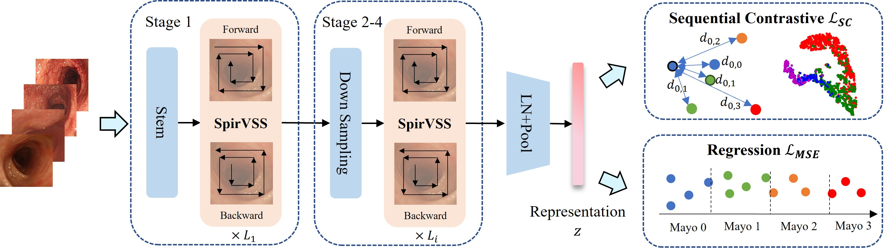

<div align="center">

# UCMamba

### UCMamba: Visual State Space Model for Ulcerative Colitis Severity Scoring with Spiral Scan and Sequential Contrastive Learning

**Xueli Chen, Moi Hoon Yap, Qi Dou, Xinqi Fan**

*IEEE Journal of Biomedical and Health Informatics*

</div>

## Overview

<p align="center">
  
</p>

## Abstract

Accurate assessment of ulcerative colitis (UC) severity from endoscopic images is critical for guiding treatment decisions and monitoring disease progression. However, significant inter- and intra-observer variability in UC severity scoring poses a major challenge to reliable evaluation. Recent advancements in Mamba-based models have shown strong performance in modeling long-range dependencies, surpassing traditional vision models in various tasks. Nonetheless, their application to vision tasks is typically limited to natural images, which exhibit structured horizontal and vertical alignments. These methods do not capture the spiral-like spatial continuities inherent in endoscopic images. To address this, we propose UCMamba, a Visual State Space Model tailored to UC severity scoring. UCMamba introduces a novel Spiral Visual State Space (SpirVSS) block, which effectively models the rotational spatial features by incorporating spiral scanning. Additionally, existing approaches often treat UC severity scoring as a multi-class classification task, neglecting the sequential relationship between severity scores. We reformulate this as a regression task and integrate a novel sequential contrastive learning approach. This method adopts a new sequence-aware paradigm for selecting positive and negative samples, and incorporates severity score distances as an adaptive margin, preserving the continuous nature of the sample order and encoding hierarchical severity relationships in the latent representation space. This enables more discriminative and clinically meaningful feature learning, thereby improving prediction performance. Experiments performed on two public benchmarks verify the effectiveness of our method.

## Installation

The installation follows the original [VMamba](https://github.com/MzeroMiko/VMamba) environment setup.


```bash
git clone https://github.com/Shirley06Chen/UCMamba_official.git
cd UCMamba

conda create -n ucmamba
conda activate ucmamba

pip install -r requirements.txt
cd kernels/selective_scan && pip install .
```

## Dataset Preparation

The experiments in the paper were conducted on the **LIMUC** and **TMC-UCM** datasets.

Please obtain the datasets from their official sources. Set the dataset path using `DATA_PATH` in `classification/run_train.sh` and `classification/run_test.sh`.

## Pretrained Models

UCMamba uses the **VMamba-Tiny (VMamba-T)** ImageNet-pretrained checkpoint for backbone initialization.

Please download the pretrained VMamba-T checkpoint from the official VMamba repository:

After downloading, set `PRETRAINED_CKPT` in `classification/run_train.sh` and `classification/run_test.sh` to the checkpoint path.

## Training

The training configuration is provided in:

```text
classification/run_train.sh
```


## Evaluation

The evaluation configuration is provided in:

```text
classification/run_test.sh
```


## Citation

If you find this work useful, please cite:

```bibtex
@article{chen2026ucmamba,
  title={UCMamba: Visual State Space Model for Ulcerative Colitis Severity Scoring with Spiral Scan and Sequential Contrastive Learning},
  author={Chen, Xueli and Yap, Moi Hoon and Dou, Qi and Fan, Xinqi},
  journal={IEEE Journal of Biomedical and Health Informatics},
  year={2026}
}
```

## Acknowledgements

This codebase is built upon [VMamba](https://github.com/MzeroMiko/VMamba). We thank the VMamba authors for making their code publicly available.

